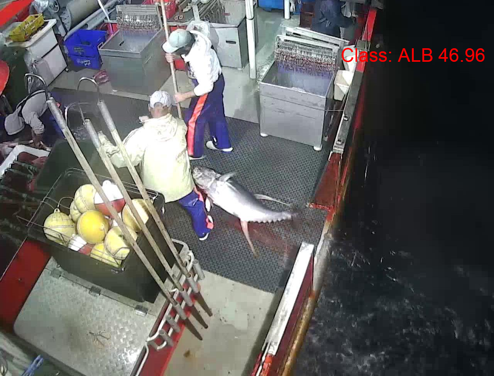
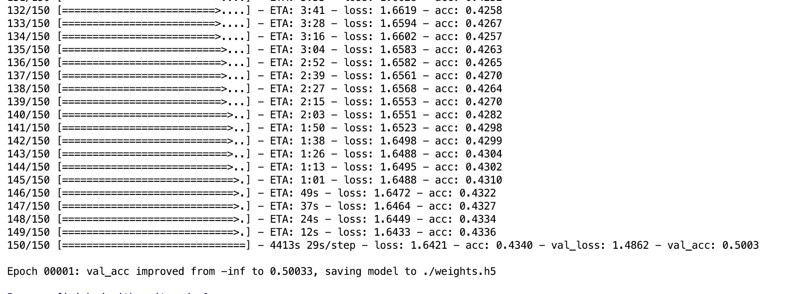

# Kaggle_Fishing_detection
Using Keras+TensorFlow to solve NCFM-Leadboard Top 5%

**Make sure that you have installed latest version of Keras since Inception_V3 is only provided
in the latest version!**

Step1. Download dataset from https://www.kaggle.com/c/the-nature-conservancy-fisheries-monitoring/data

Step2. Changing your own directory

Step3. Use ```split_train_val.py``` to split the labed data into training and validation.
Usually, 80% for training and 20% for validation is a good start.

Step4. Use ```train.py``` to train a Inception_V3 network. The best model and its weights will be saved as "weights.h5".

Step5. Use ```predict.py``` to predict labels for testing images and generating the submission file "submit.csv".
Note that such submission results in a 50% ranking in the leaderboard.

Step6. In order to improve our ranking, we use data augmentation for testing images. The intuition behind is similar to multi-crops,
which makes use of voting ideas. ```predict_average_augmentation.py``` implements such idea and results in a 10% ranking (Public Score: 1.09) in the leaderboard.

Step7. Note that there is still plenty of room for improvement. For example, we could split data into defferent training and valition
data by cross-validation, e.g. k-fold. Then we train k models based on these splitted data. We average the predictions output by the k models as the final submission. This strategy will result a 5% ranking (Public Score: 1.02) in the leaderboard. We will leave the implementation as a practice for readers :)

Step8: if you wanna to improve ranking further, object detection is your next direction!

**Update and Note:** In order to use ```flow_from_directory()```, you should create a folder named **test_stg1** and put the original test_stg1 inside it.

#results




